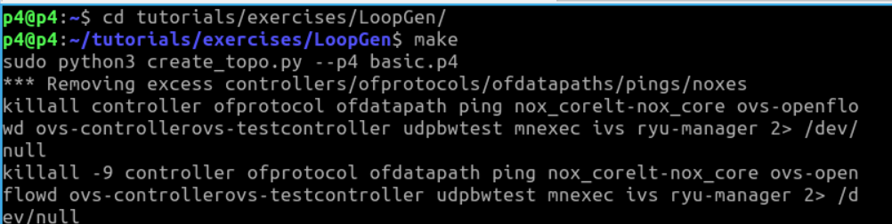
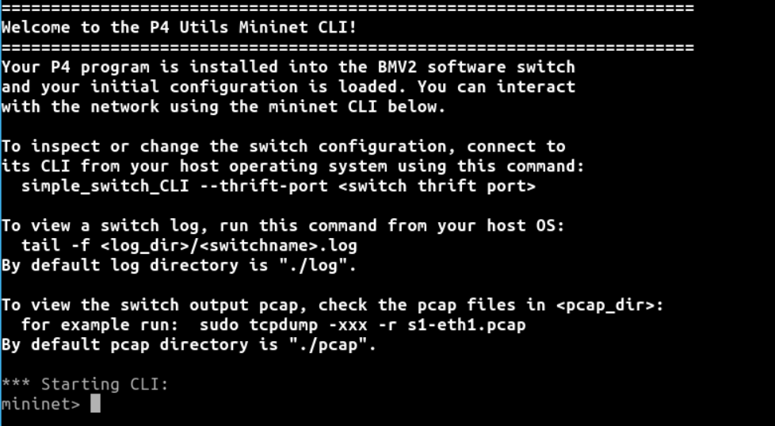
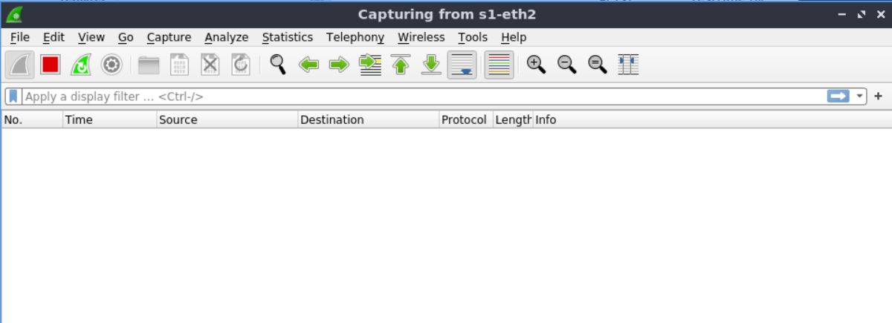
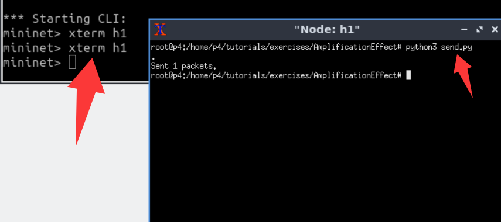
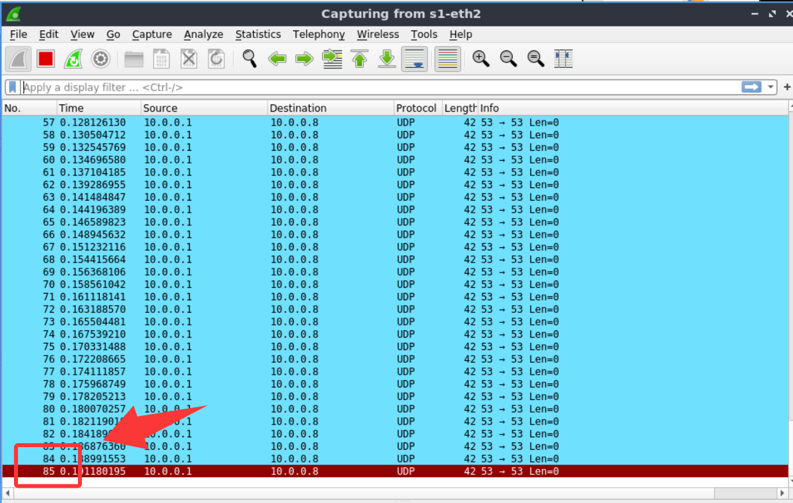
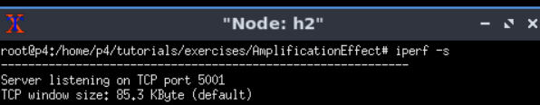
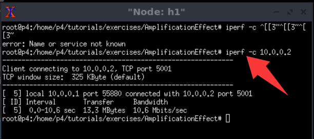
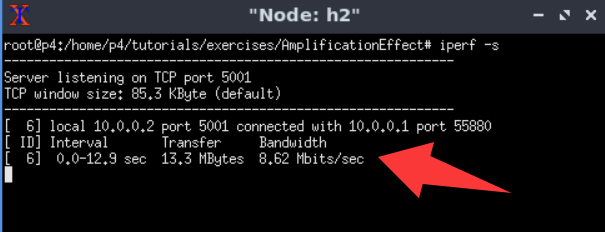
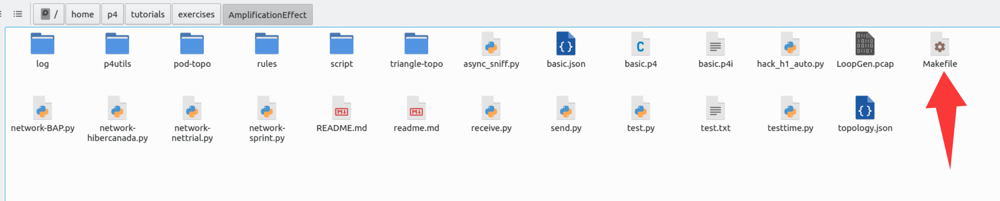
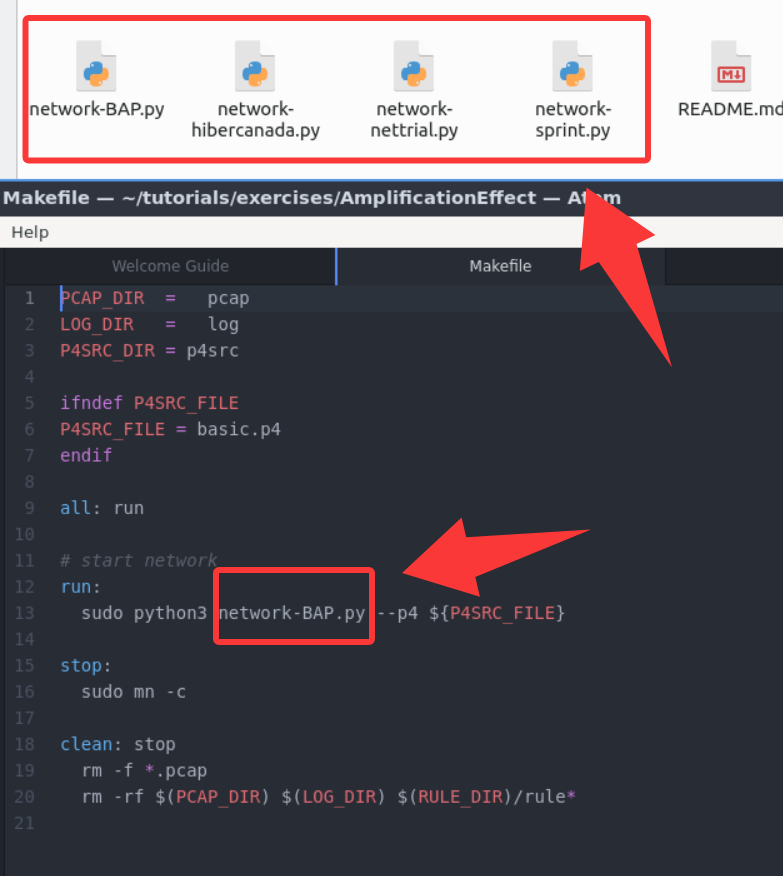

## Usage

Before starting, please **download** our VM.

The following instructions use the UDP packet as the example. If you want to try the attack effect under ARP packets, please enter the directory `tutorials/exercises/AmplificationEffect-ARP/` (the evaluation process is the same).

1. Open a terminal (entering the p4 directory by defailt). 

<div align="center">
  
</div>

2. Enter a new directory and start the topology:
```
cd tutorials/exercises/AmplificationEffect/
make
```
<div align="center">
  
</div>

Then, the topology is correctly started as follows.

<div align="center">
  
</div>


### A. Evaluate amplification factor

1. Open wireshark (**before** sending any packets). Then, monitor the **s1-eth2** port.
```bash
sudo wireshark
```

<div align="center">
  
</div>

You can see that there is no packet now.

<div align="center">
  
</div>

2. In the mininet terminal
```
mininet> xterm h1
h1>  python3 send.py
```

<div align="center">
  
</div>


`send.py` sends **one** packet whose TTL is 255.
Then, you can see that there are 85 packets captured by wireshark, which means that this packet was looped 85 times (amplification factor is 85)

<div align="center">
  
</div>


### B. RTT

1. First, open an h1 xterm
```
mininet> xterm h1
```

Use `tcpreplay` to inject attack packets.

```
h1> tcpreplay -i h1-eth0 -p 300 -l 0 LoopGen.pcap
```

<div align="center">
  
</div>

2. Then, open a new h1 xterm and `ping` h2
```
h1> ping 10.0.0.2
```

<div align="center">
  
</div>

### C. Throughput

1. First, open an h1 xterm
```
mininet> xterm h1
```

Use `tcpreplay` to inject attack packets.
```
    h1> tcpreplay -i h1-eth0 -p 300 -l 0 LoopGen.pcap
```

2. Then, open a new h1 xterm and an h2 xterm
```
    mininet> xterm h1 h2
```

3. In the h2 xterm, start an `iperf` TCP server
```
    h2> iperf -s
```

<div align="center">
  
</div>

4. In ther new h1 xterm (do **not** change the other h1 xterm running `tcpreplay`)
```
    h1> iperf -c 10.0.0.2
```

<div align="center">
  
</div>

5. Then, on the h2 xterm, you can see the evaluated bandwidth (the maximum is 10Mbps so we can calculate the degradation). For example, in the following figure, the degradation is (10-9.62)/10=13.8%.

<div align="center">
  
</div>


## Change

If we want to change other topologies, please edit the `Makefile` 

<div align="center">
  
</div>

The default topology is `network-BAP.py`, the other available topologies are shown as follows. We can edit the `Makefile` to change topologies.

<div align="center">
  
</div>


The raw data and figures are in the `RawData&Figures` directory. You can open the `.ipynb` file using [Visual Studio code](https://code.visualstudio.com/).