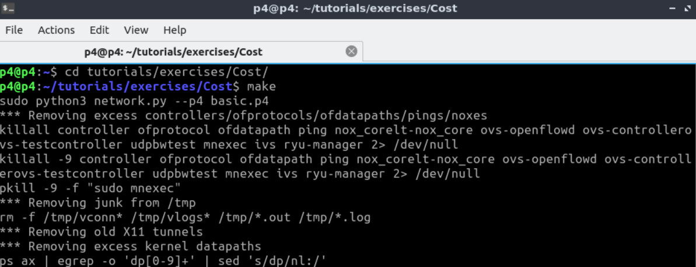
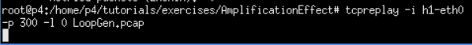
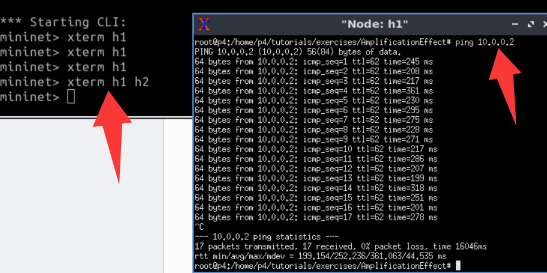
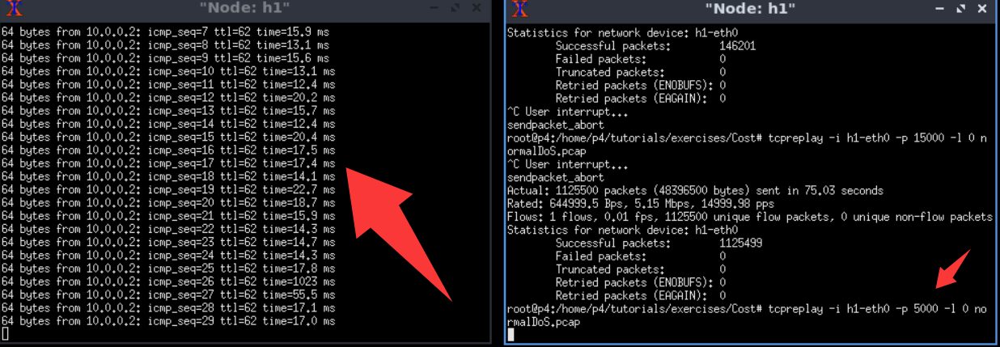
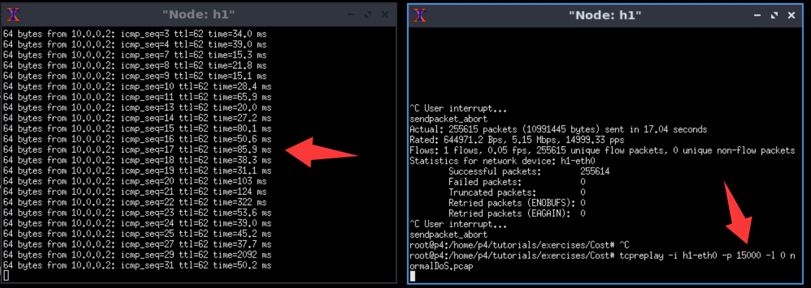

## Usage 

1. Open a terminal (entering the p4 directory by defailt). 

<div align="center">
  
</div>

2. Enter a new directory and start the topology:
```
    cd tutorials/exercises/Cost/

    make
```
<div align="center">
  
</div>

Then, the topology is correctly started as follows.

<div align="center">
  
</div>


### Launch LoopGen

1. First, open an h1 xterm
```
    mininet> xterm h1
```
Use `tcpreplay` to inject attack packets.

    h1> tcpreplay -i h1-eth0 -p 300 -l 0 LoopGen.pcap


<div align="center">
  
</div>

2. Then, open a new h1 xterm and `ping` h2
```
    h1> ping 10.0.0.2
```

<div align="center">
  
</div>

### Launch normal DoS

1. First, open an h1 xterm
```
    mininet> xterm h1
```
Use `tcpreplay` to inject attack packets. Note: use **normalDoS.pcap** instead of LoopGen.pcap. Increase the speed (`-p`) gradually (5,000, 10,000, 15,000, 20,000, ...) until the latency reaches the same level under LoopGen. Then, the speed of tcpreplay is the cost.
```
    h1> tcpreplay -i h1-eth0 -p 5000 -l 0 normalDoS.pcap
```

2. Then, open a new h1 xterm and `ping` h2
```
    h1> ping 10.0.0.2
```
5000pps, normal DoS
<div align="center">
  
</div>


15000pps, normal DoS
<div align="center">
  
</div>


