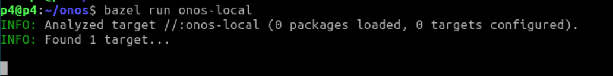
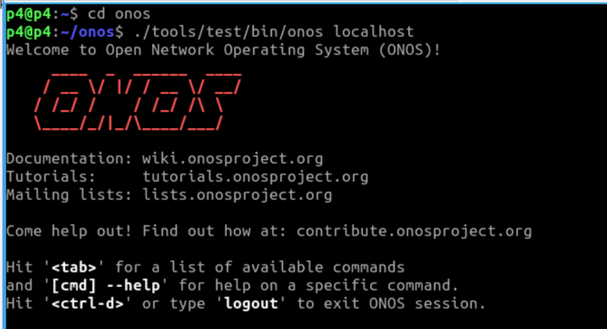
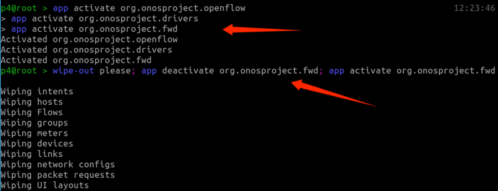
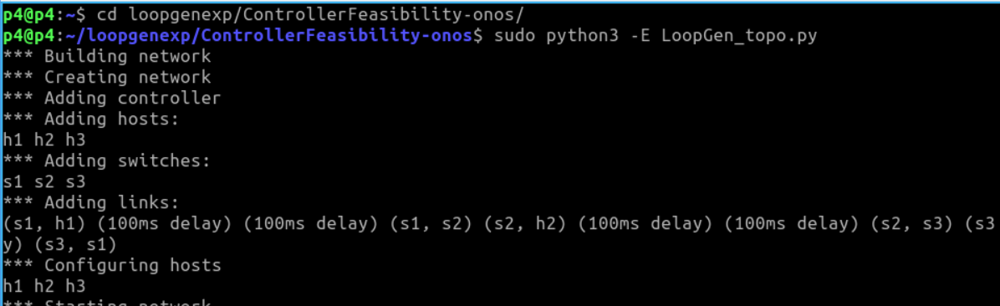
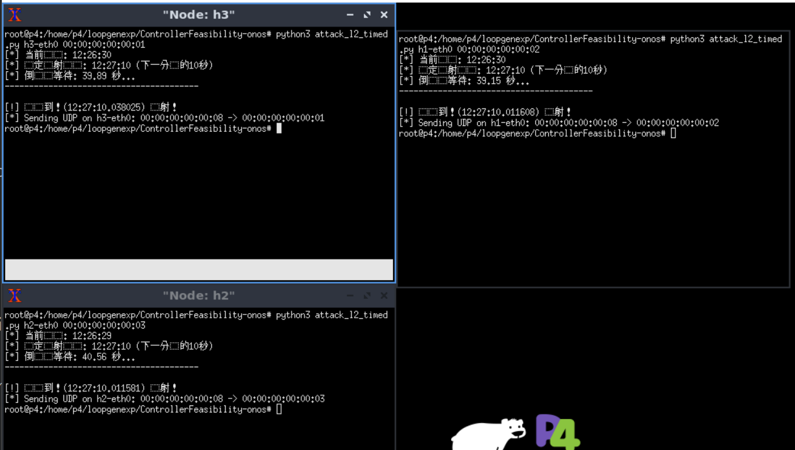
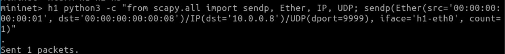
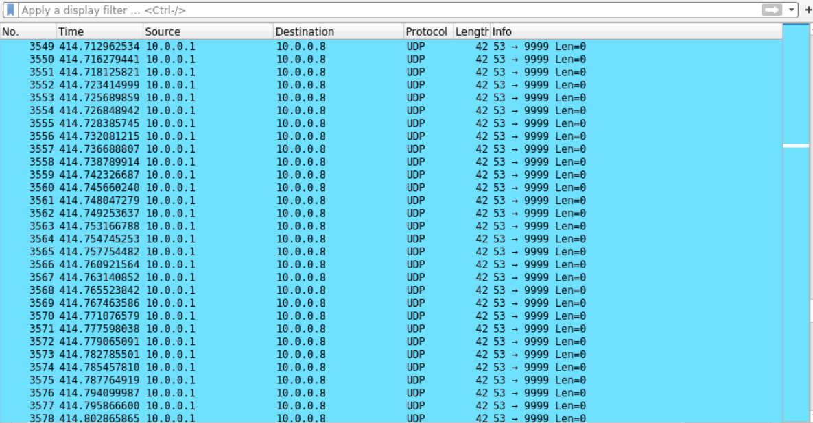

# Usage


1. Open a terminal (entering the p4 directory by default)


2. Enterh the `onos` directory
```bash
cd onos

bazel run onos-local
```



3. Open a new terminal, enter the `onos` directory
```
cd onos

./tools/test/bin/onos localhost
```




4. Start the app
```bash
app activate org.onosproject.openflow
app activate org.onosproject.drivers
app activate org.onosproject.fwd
wipe-out please; app deactivate org.onosproject.fud; app activate org.onosproject. fwd
```



5. Open a new terminal
```bash
cd loopgenexp/ControllerFeasibility-onos/

sudo python3 -E LoopGen_topo.py

xterm h1 h2 h3
```




6. Launch attack

In h1 xterm, run
```
python3 attack_l2_timed.py h1-eth0 00:00:00:00:00:02
```

In h2 xterm, run
```
python3 attack_l2_timed.py h2-eth0 00:00:00:00:00:03
```

In h3 xterm, run
```
python3 attack_l2_timed.py h3-eth0 00:00:00:00:00:01
```




7. Then, in the mininet terminal

```
mininet> h1 python3 -c "from scapy.all import sendp, Ether, IP, UDP; sendp(Ether(src='00:00:00:00:00:01', dst='00:00:00:00:00:08')/IP(dst='10.0.0.8')/UDP(dport=9999), iface='h1-eth0', count=1)"
```



8. Open a new terminal and start wireshark

```
sudo wireshark
```

You can see that the attack packet was looped.




