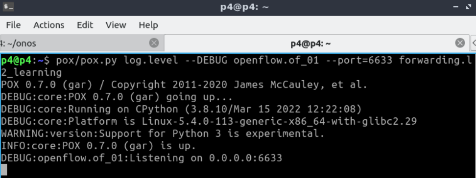
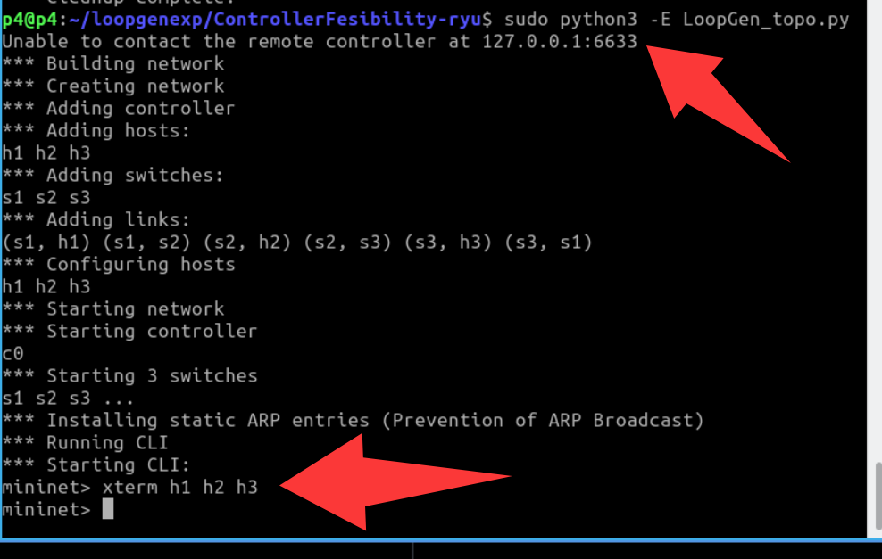
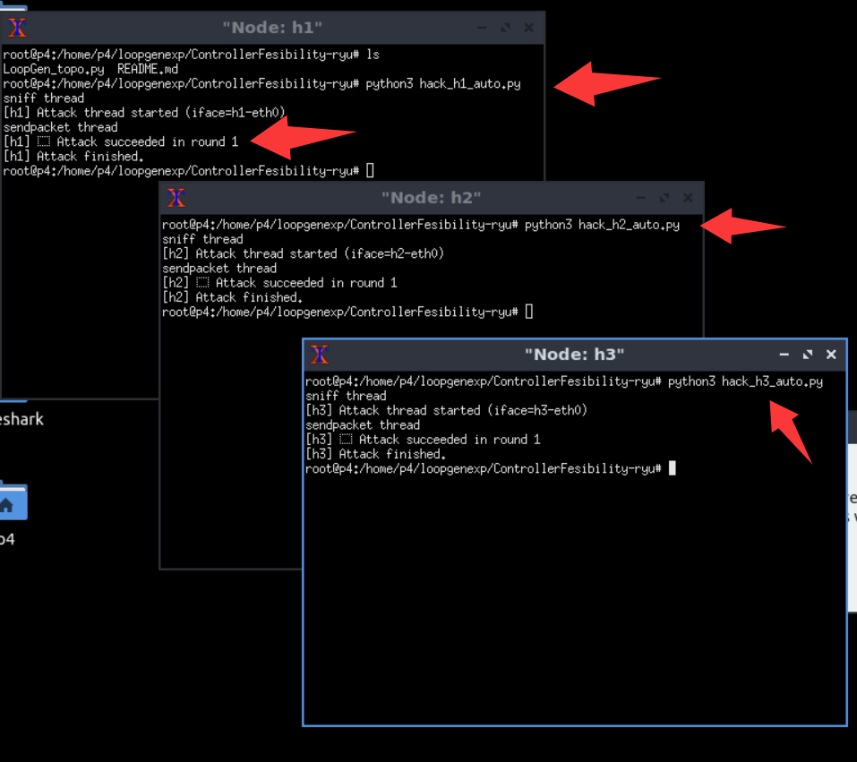

# Usage

## Usage

1. Open a terminal (entering the p4 directory by default)

<div align="center">
  
</div>

2. Start the controller
```bash
./pox.py log.level --DEBUG openflow.of_01 --port=6633 forwarding.l2_learning
```

<div align="center">
  
</div>

3. Open a new terminal and start mininet topology
```bash
cd loopgenexp/ControllerFeasibility-pox/l2/
sudo python3 -E LoopGen_topo.py
```
<div align="center">
  
</div>


4. Open the host terminals in mininet
```bash
mininet> xterm h1 h2 h3
```

5. Send packets in each host terminal

In h1 xterm, run
```
    python3 hack_h1_auto.py
```
In h2 xterm, run
```
    python3 hack_h2_auto.py
```
In h3 xterm, run
```
    python3 hack_h3_auto.py
```
<div align="center">
  
</div>

Please **wait** until all hosts finshed the attack (as shown in the above figure).

6. Open a new terminal and start wireshark. Then, monitor the **s1-eth2** port.
```bash
sudo wireshark
```

<div align="center">
  
</div>

7. For convenience, filter only arp packets. You can see that the attack packets are looped continuously.

<div align="center">
  
</div>


