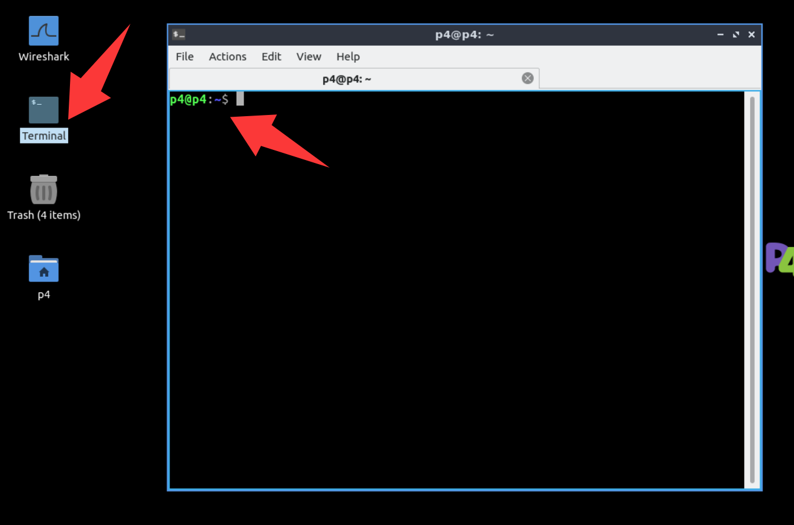
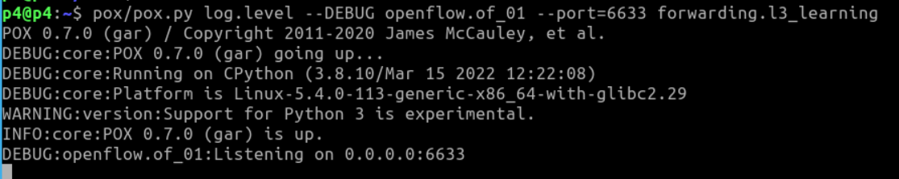
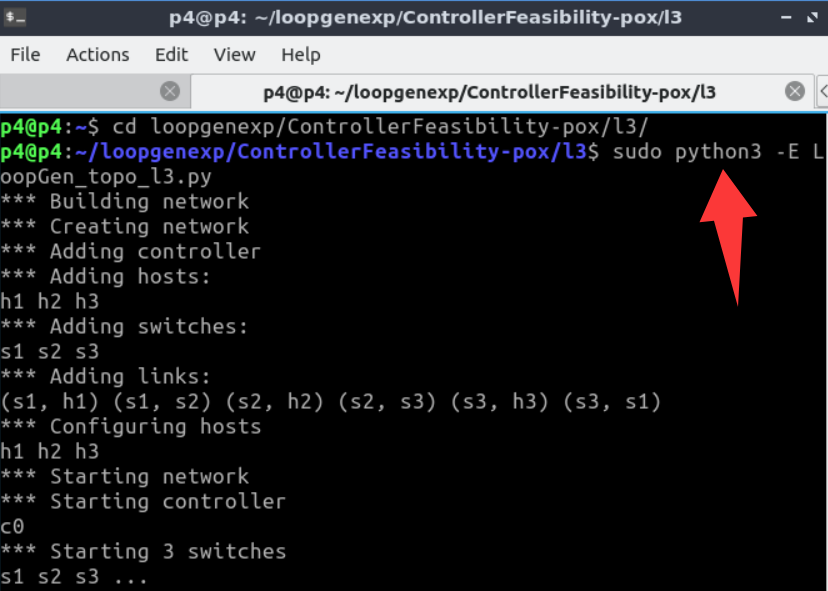
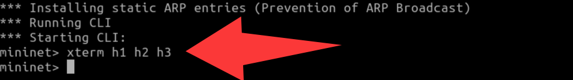
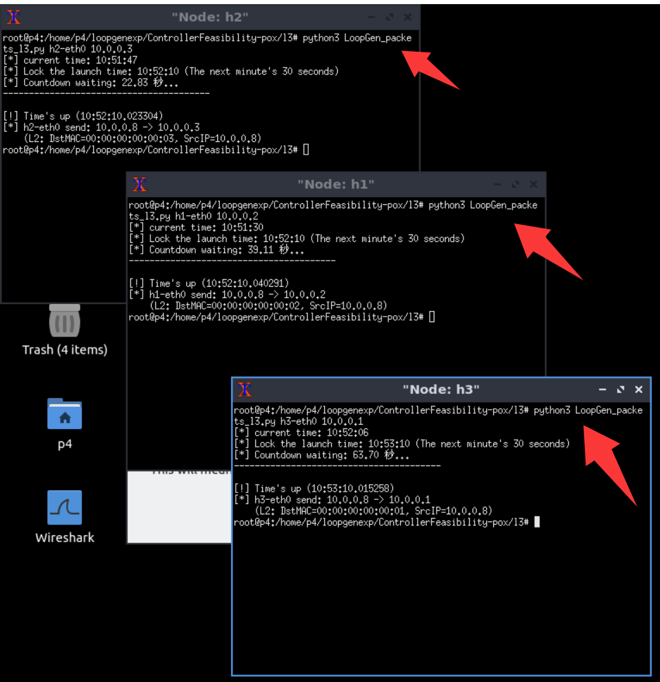

## Usage

Before starting, please **download** our VM.


1. Open a terminal (entering the p4 directory by default)

<div align="center">
  
</div>

2. Start the controller
```bash
pox/pox.py log.level --DEBUG openflow.of_01 --port=6633 forwarding.l3_learning
```

<div align="center">
  
</div>

3. Open a new terminal and start mininet topology
```bash
cd loopgenexp/ControllerFeasibility-pox/l3/
sudo python3 -E LoopGen_topo_l3.py
```
<div align="center">
  
</div>


4. Open the host terminals in mininet
```bash
mininet> xterm h1 h2 h3
```

<div align="center">
  
</div>

5. Send packets in each host terminal

Note: Don't hit Enter right away when starting the attack scripts on the three hosts. Type the command on all three first, then press Enter on all of them at once, so that the attacks begin at nearly the same time instead of being staggered too far apart.

```bash
# Node: h1
python3 LoopGen_packets_l3.py h1-eth0 10.0.0.2
# Node: h2
python3 LoopGen_packets_l3.py h2-eth0 10.0.0.3
# Node: h3
python3 LoopGen_packets_l3.py h3-eth0 10.0.0.1
```
<div align="center">
  
</div>

Please **wait** until all hosts finshed the attack (as shown in the above figure).

6. Open a new terminal and start wireshark. Then, monitor the **s1-eth2** port.
```bash
sudo wireshark
```

<div align="center">
  
</div>

7. For convenience, filter only arp packets. You can see that the attack packets are looped continuously.

<div align="center">
  
</div>

