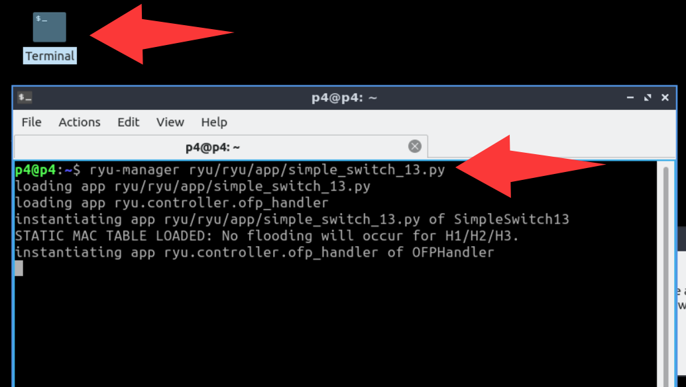
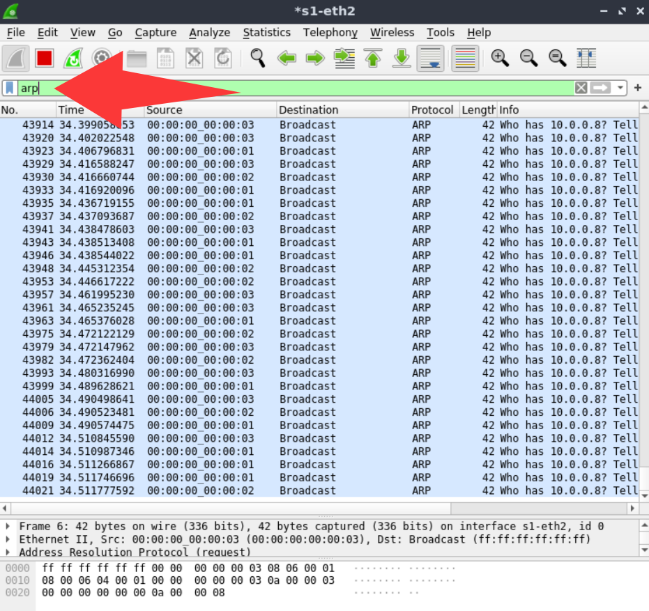

## Usage

1. Open a terminal (entering the p4 directory by default)


2. Start the controller
```bash
ryu-manager ryu/ryu/app/simple_switch_13.py
```



3. Open a new terminal and start mininet topology
```bash
cd loopgenexp/ControllerFeasibility-ryu/
sudo python3 -E LoopGen_topo.py
```


4. Open the host terminals in mininet
```bash
mininet> xterm h1 h2 h3
```

5. Send packets in each host terminal

In h1 xterm, run

    python3 hack_h1_auto.py

In h2 xterm, run

    python3 hack_h2_auto.py

In h3 xterm, run

    python3 hack_h3_auto.py


Please **wait** until all hosts finshed the attack (as shown in the above figure).

6. Open a new terminal and start wireshark. Then, monitor the **s1-eth2** port.
```bash
sudo wireshark
```


7. For convenience, filter only arp packets. You can see that the attack packets are looped continuously.




