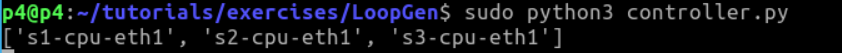
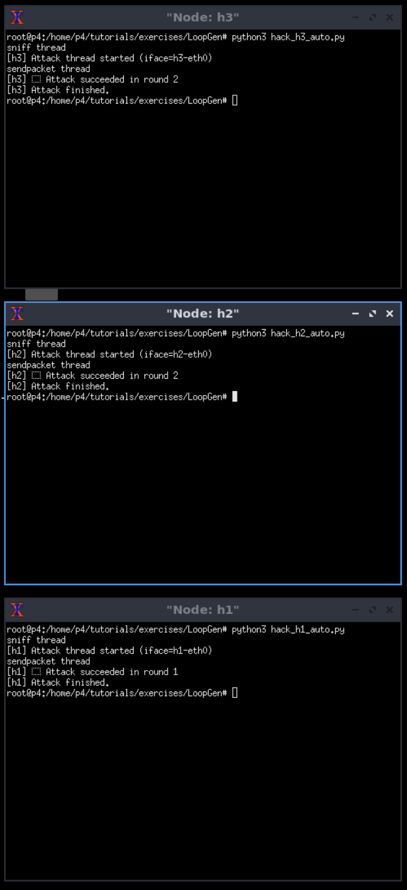
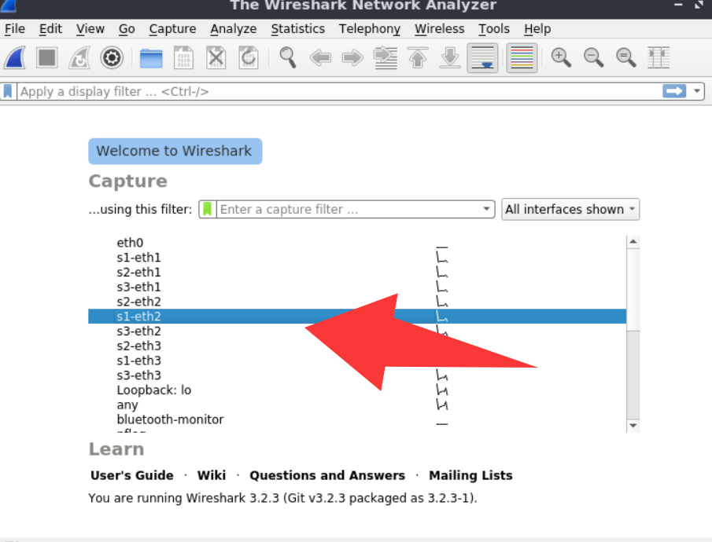
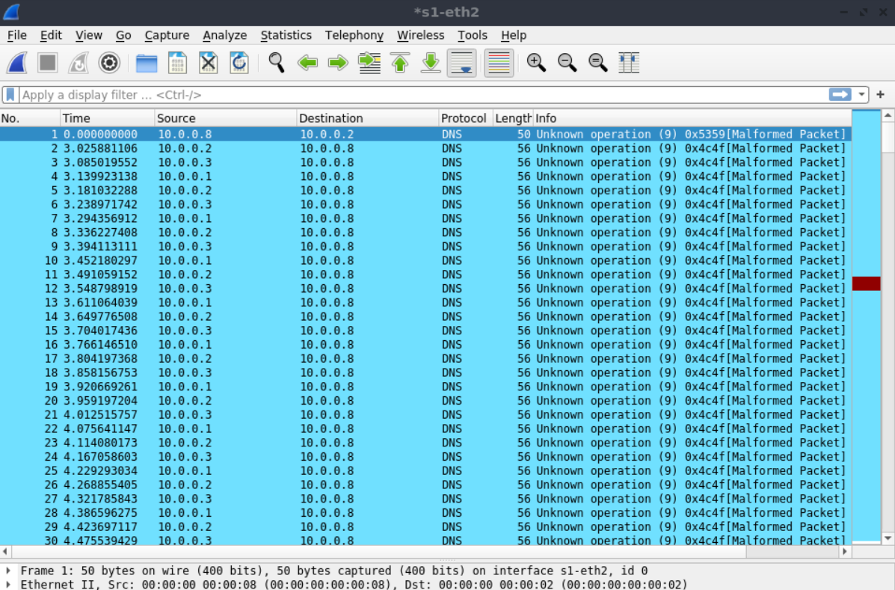

# Usage

1. Open a terminal (entering the p4 directory by defailt). 


2. Enter a new directory and start the topology:

    cd tutorials/exercises/LoopGen/
    make


Then, the topology is correctly started as follows.


If find any compiling errors, please try:

    make clean
    make

3. Open another terminal and start the controller

    cd tutorials/exercises/LoopGen/
    sudo python3 controller.py



4. In the mininet terminal

    xterm h1 h2 h3

In h1 xterm, run

    python3 hack_h1_auto.py

In h2 xterm, run

    python3 hack_h2_auto.py

In h3 xterm, run

    python3 hack_h3_auto.py



Please **wait** until they finished the attack.

5. Open a new terminal and start wireshark. Then, monitor the **s1-eth2** port.
```bash
sudo wireshark
```



You can see that the attack packets are looped continuously.




