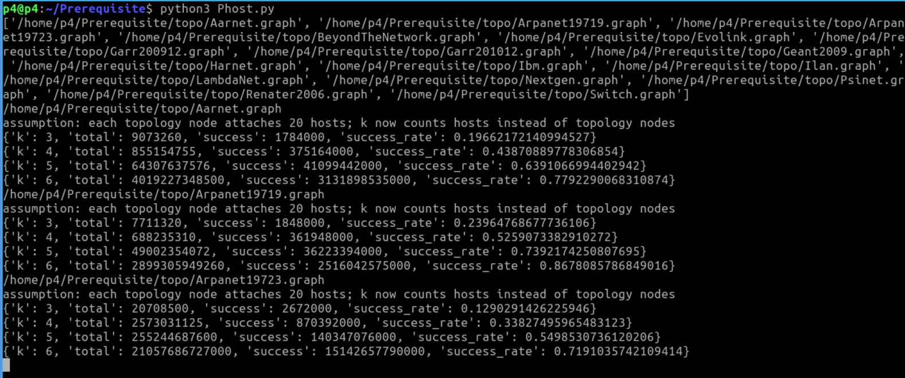

# How to run

Directly run the .py file, it will output the probability of p-topo, i.e., if randomly select a set of k switches, the probability that a network contains loop structures.

ptopo.py: the probability that switches form a loop structure. (This file is useless after the rebuttal)

 Open a terminal (entering the p4 directory by default)

<div align="center">
  
</div>

```
cd Prerequisite
```

#### Phost.py: the probability that hosts form a loop structure.
```
python3 Phost.py
```
<div align="center">
  
</div>

#### LSandFT.py: the probability that hosts form a loop structure in Leaf-Spine and Fat-Tree.

```
python3 LSandFT.py
```
<div align="center">
  
</div>
