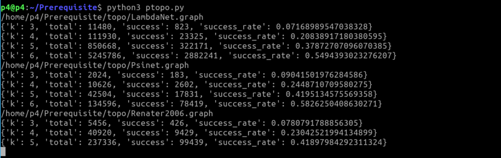
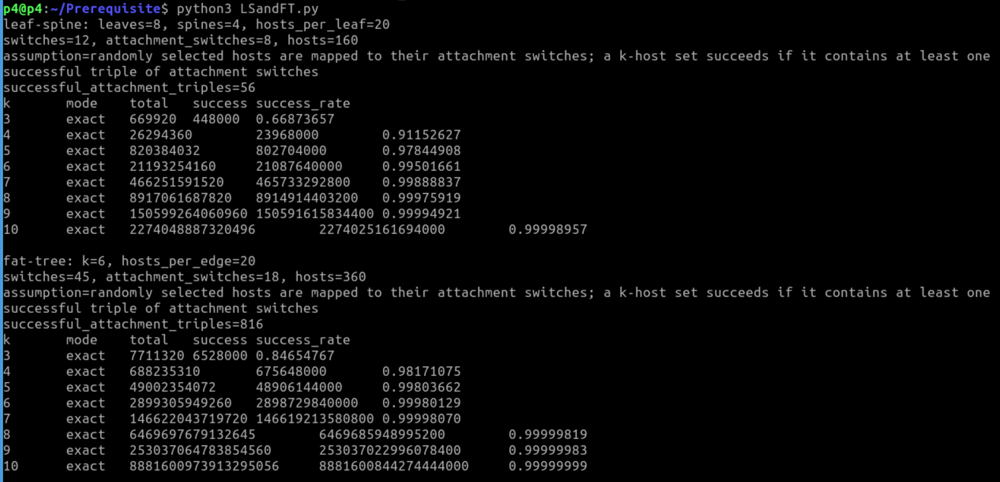

# How to run

Directly run the .py file, it will output the probability of p-topo, i.e., if randomly select a set of k switches, the probability that a network contains loop structures.

ptopo.py: the probability that switches form a loop structure. (This file is useless after the rebuttal)

#### Phost.py: the probability that hosts form a loop structure.

#### LSandFT.py: the probability that hosts form a loop structure in Leaf-Spine and Fat-Tree.

