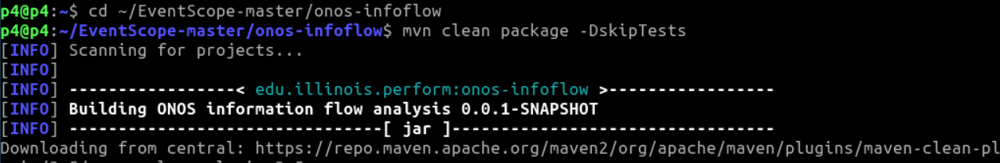
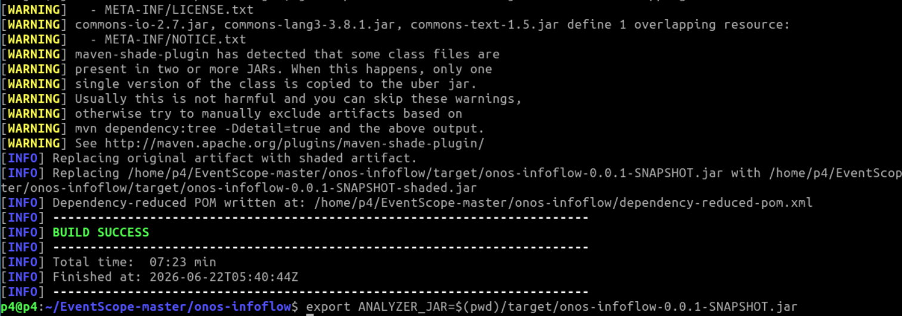
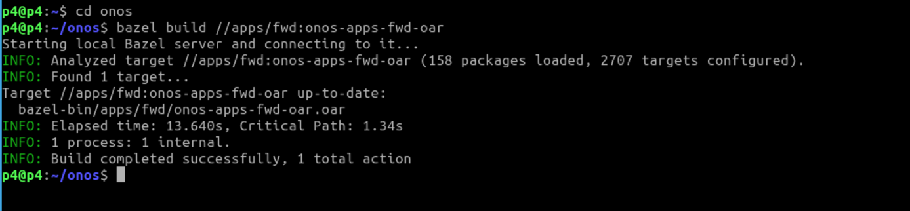
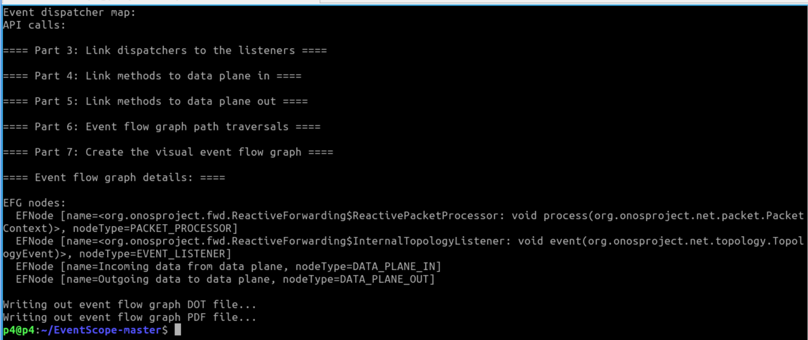
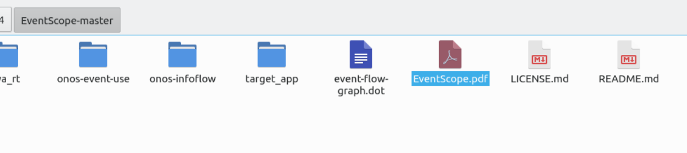
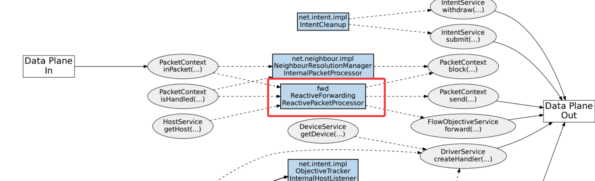

## Usage

The default JDK is 11, so firstly, please switch to JDK 8.

```
export JAVA_HOME=/usr/lib/jvm/java-8-openjdk-amd64
export PATH=$JAVA_HOME/bin:$PATH
java -version
```

<div align="center">
  
</div>


1. Compile the EventScope analysis tool
```bash
cd ~/EventScope-master/onos-infoflow
mvn clean package -DskipTests
export ANALYZER_JAR=$(pwd)/target/onos-infoflow-0.0.1-SNAPSHOT.jar
```
<div align="center">
  
</div>
<div align="center">
  
</div>

2. Prepare the target app
```bash
cd ~/onos
bazel build //apps/fwd:onos-apps-fwd-oar
```
<div align="center">
  
</div>
```
mkdir -p ~/EventScope-master/target_app
cd ~/EventScope-master/target_app
cp ~/onos/bazel-bin/apps/fwd/onos-apps-fwd-oar.oar ~/EventScope-master/target_app/fwd_app.zip
unzip ~/EventScope-master/target_app/fwd_app.zip -d ~/EventScope-master/target_app/
```

3. Build an analytical environment
```bash
cd ~/EventScope-master

4. Create the expected directory structure for EventScope
mkdir -p bin
mkdir -p java_rt

5. Insert the class file of the target App
APP_JAR=$(find ./target_app -name "onos-apps-fwd-*.jar" | head -n 1)
echo "Found App Jar: $APP_JAR"

6. Copy and extract the target App to the bin directory
cp "$APP_JAR" bin/
cd bin
unzip -q -o *.jar
rm *.jar

7. Put it into the Java runtime environment
cd ..
cp /usr/lib/jvm/java-8-openjdk-amd64/jre/lib/rt.jar java_rt/
cd java_rt
unzip -q -o rt.jar
rm rt.jar
cd ..
```

8. Run static analysis
```bash
cd ~/EventScope-master
java -jar $ANALYZER_JAR
```
<div align="center">
  
</div>

You can directly see the .pdf report 

<div align="center">
  
</div>

We can see that the attack does not introduce new event listeners or data plane interaction paths in the graph. This is because it merely adds static mappings to the existing event handling logic, thereby altering the forwarding semantics but not the event flow structure. Therefore, EventScope cannot detect it.

<div align="center">
  
</div>