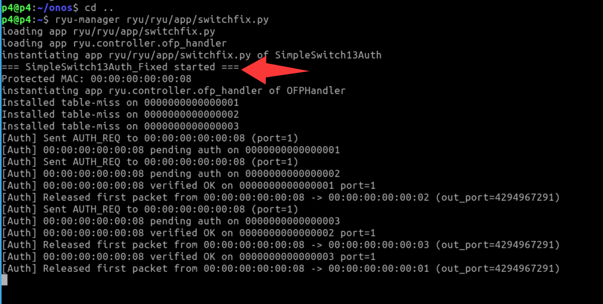
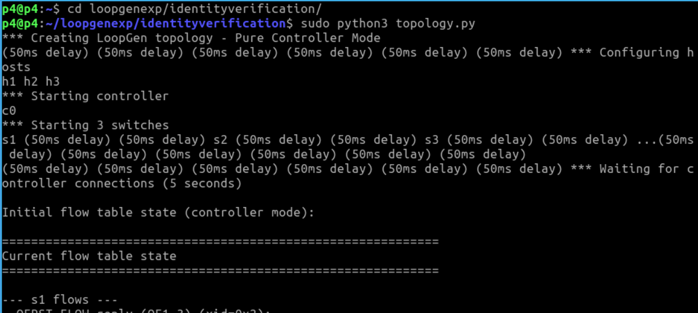
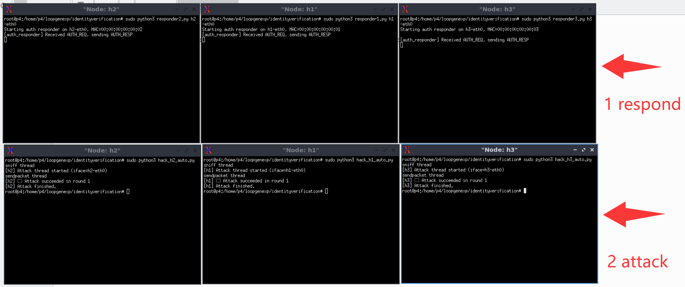
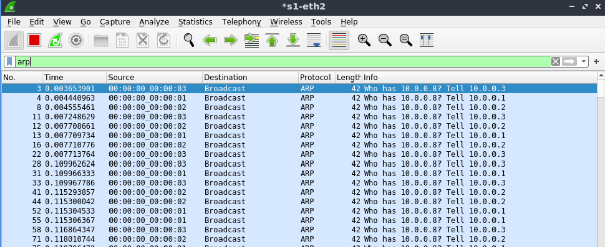

## Usage

1. Open a terminal (entering the p4 directory by default)

<div align="center">
  
</div>


2. Start the identify verification application


```plain
sudo ryu/ryu/app/ryu-manager switchfix.py
```

<div align="center">
  
</div>


3. Start the Mininet topology
Open a second terminal (Topology Terminal).

```plain
cd loopgenexp/identityverification/

sudo python3 topology.py
```

<div align="center">
  
</div>


4. Open *6* host xterms

```plain
mininet> xterm h1 h2 h3
mininet> xterm h1 h2 h3
```

5. Start the responder (host authentication responder) on each host

These scripts are used to handle controller's identity verification

In the `h1` xterm:

```plain
sudo python3 responder1.py h1-eth0
```

In the `h2` xterm:

```plain
sudo python3 responder2.py h2-eth0
```

In the `h3` xterm:

```plain
sudo python3 responder3.py h3-eth0
```

<div align="center">
  
</div>


6. Start LoopGen attack scripts
In `h1` xterm run the h1 attack:

```plain
sudo python3 hack_h1_auto.py
```

In `h2` xterm:

```plain
sudo python3 hack_h2_auto.py
```

In `h3` xterm:

```plain
sudo python3 hack_h3_auto.py
```

7. Then, open a wireshark and monitor **s1-eth2**, you can see endless packets.

<div align="center">
  
</div>
