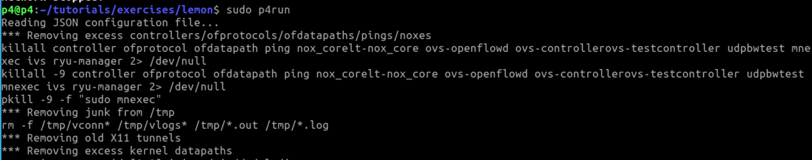
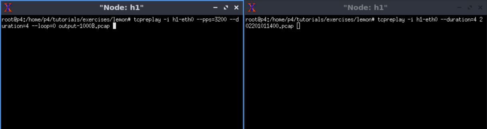
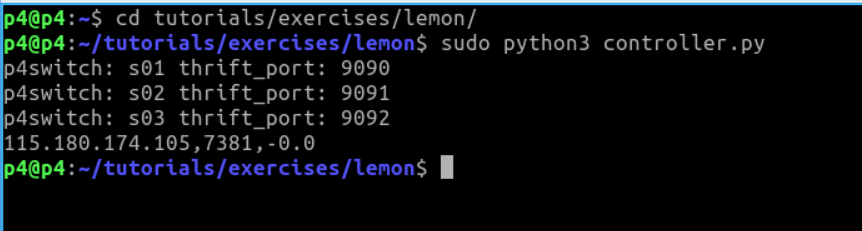
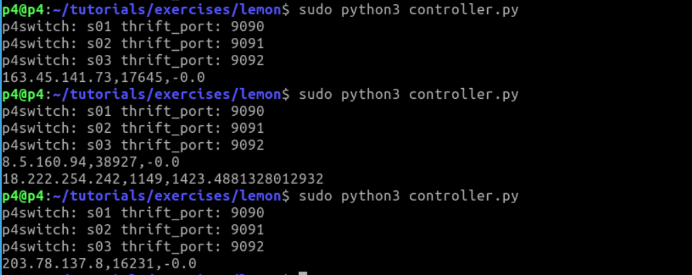
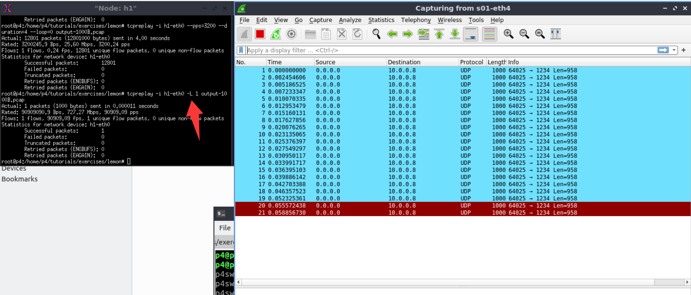

The version of [Lemon](https://github.com/f-555/Lemon) we obtained and used is in Janurary 2026.

## Usage

Before starting, please **download** our VM.


1. Open a terminal (entering the p4 directory by default)

<div align="center">
  
</div>

2. Start the BMv2-based Mininet experimental environment

```
cd tutorials/exercises/lemon/

sudo p4run
```   

<div align="center">
  
</div>

3. Start attack

The ``output-1000B.pcap`` is the attack traffic set and the [202201011400.pcap](https://mawi.wide.ad.jp/mawi/samplepoint-F/2022/202201011400.html) is the background traffic.

```
mininet> xterm h1 h1
    h1> tcpreplay -i h1-eth0 --duration=4 output-1000B.pcap
    h1> tcpreplay -i h1-eth0 --pps=3200 --duration=4 --loop=0 202201011400.pcap
```
<div align="center">
  
</div>

4. Open a new terminal and start the Lemon controller

```  
sudo python3 controller.py
```
<div align="center">
  
</div>

See the output of the controller. `10.0.0.8` is not in the output. We can try the attack multiple times.

<div align="center">
  
</div>

5. Verify loop

We can also verify whether the loop was established by sending only one attack packet.

```
h1> tcpreplay -i h1-eth0 -L 1 output-1000B.pcap

```

Then, open a new terminal and start wireshark

```
sudo wireshark
```

We can see that one packet was looped multiple times, which proves that the attack traffic was looped.

<div align="center">
  
</div>


