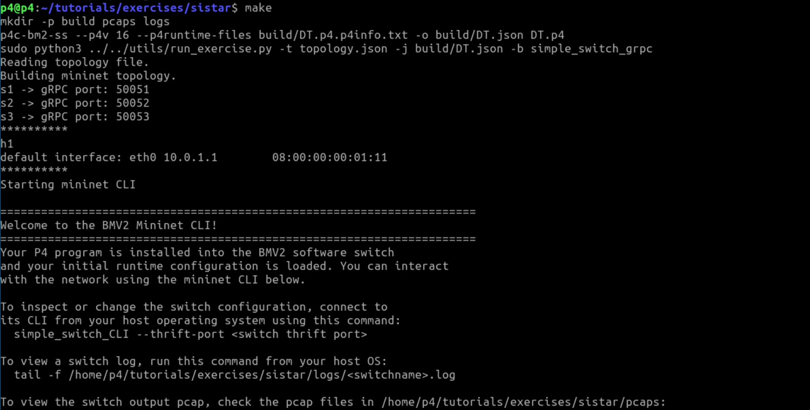
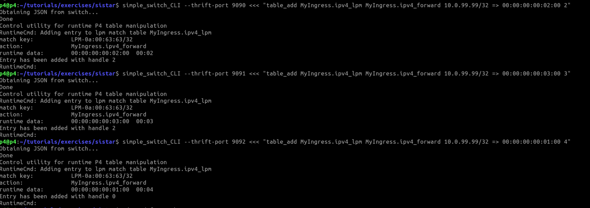
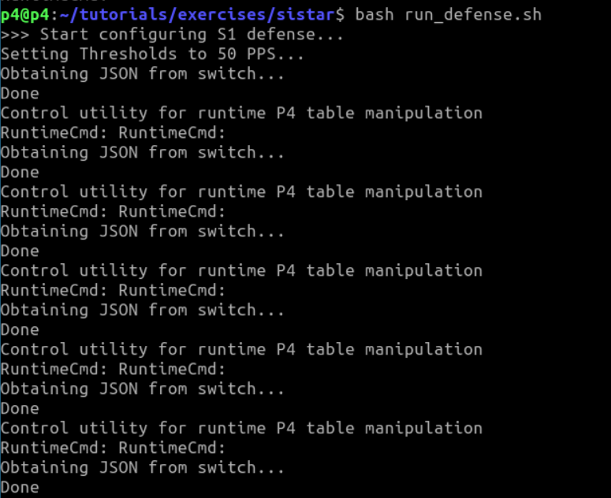
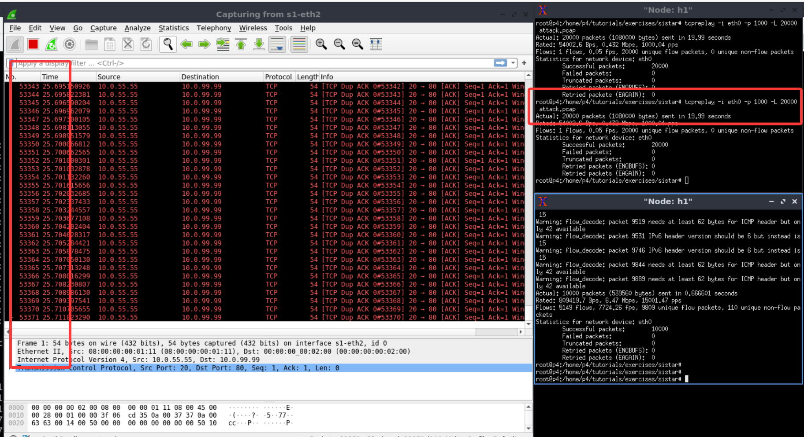

The version of [SISTAR](https://github.com/hugo0819/SISTAR) we obtained and used is in Janurary 2026.

## Usage

Before starting, please **download** our VM.


1. Open a terminal (entering the p4 directory by default)

<div align="center">
  
</div>

3. Start the BMv2-based Mininet experimental environment

```
cd tutorials/exercises/sistar/

make
```   

<div align="center">
  
</div>


4. Open a new terminal, install flow rules for the S1-S2-S3 triangle loop topology
```
cd tutorials/exercises/sistar/

simple_switch_CLI --thrift-port 9090 <<< "table_add MyIngress.ipv4_lpm MyIngress.ipv4_forward 10.0.99.99/32 => 00:00:00:00:02:00 2"

simple_switch_CLI --thrift-port 9091 <<< "table_add MyIngress.ipv4_lpm MyIngress.ipv4_forward 10.0.99.99/32 => 00:00:00:00:03:00 3"

simple_switch_CLI --thrift-port 9092 <<< "table_add MyIngress.ipv4_lpm MyIngress.ipv4_forward 10.0.99.99/32 => 00:00:00:00:01:00 4"
```

<div align="center">
  
</div>


5. Deploy the defense mechanism
```
bash run_defense.sh
```

<div align="center">
  
</div>


6. Open 2 xterm, and send background traffic and attack traffic
```
tcpreplay -i eth0 -p 15000 -L 10000 ./202201011400.pcap &

tcpreplay -i eth0 -p 1000 -L 20000 attack.pcap
```

In case that you cannot find the `attack.pcap`, please run `packet_gen.py` to generate it

```
python3 packet_gen.py
```

Then, we can open wireshark and monitor s1-eth2. After that, inject one attack packet 
```

tcpreplay -i eth0 -p 1000 -L 1 attack.pcap
```

 We can find that the attack packets (dst=`10.0.99.99`) were looped.

<div align="center">
  
</div>


