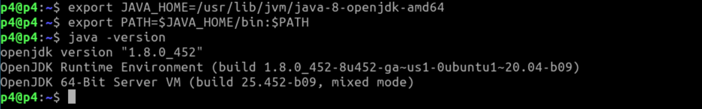
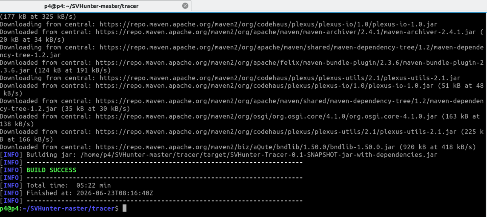
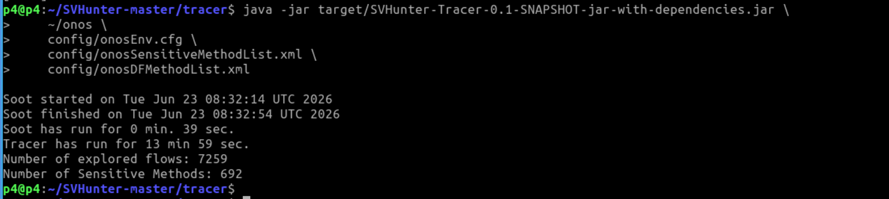
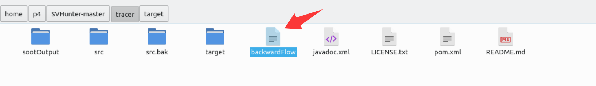

# Usage

[SVHunter](https://github.com/xiaofen9/SVHunter)

If the Soot version in the SVHunter configuration file (SVHunter-master/tracer/pom.xml) is too low, you may consider using the provided [pom.xml](pom.xml).


The default JDK is 11, so firstly, please switch to JDK 8.

```
export JAVA_HOME=/usr/lib/jvm/java-8-openjdk-amd64
export PATH=$JAVA_HOME/bin:$PATH
java -version
```

<div align="center">
  
</div>


1. Compile the analysis tool
```bash
cd ~/SVHunter-master/tracer
mvn clean package
```

<div align="center">
  
</div>


2. Running analysis
```bash
java -jar target/SVHunter-Tracer-0.1-SNAPSHOT-jar-with-dependencies.jar \
    ~/onos \
    config/onosEnv.cfg \
    config/onosSensitiveMethodList.xml \
    config/onosDFMethodList.xml
```

<div align="center">
  
</div>


3. The result is in `~/SVHunter-master/tracer/backwardFlow`. We can analyze it and find that there is no anly alert about `ReactiveForwarding`, which means that LoopGen will not be detected by SVHunter.

<div align="center">
  
</div>
