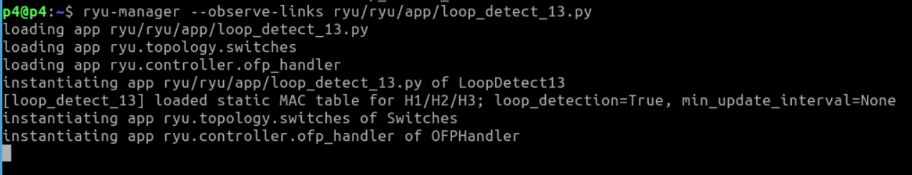
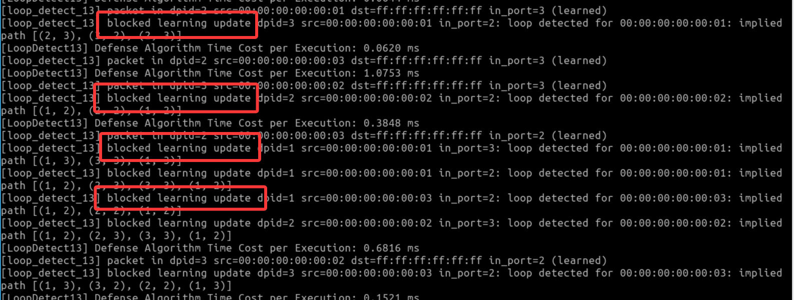
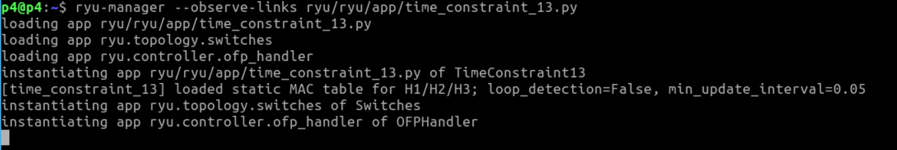
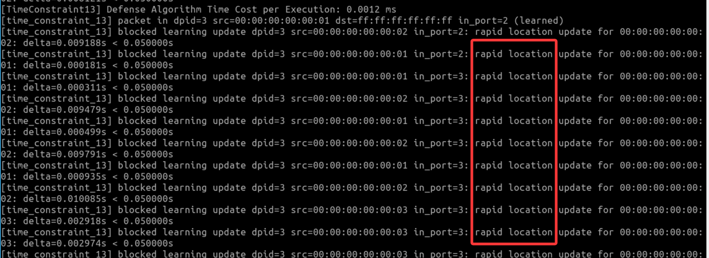

## Usage

1. Open a terminal (entering the p4 directory by defailt). 


#### Method 1: Loop Detection Countermeasure:

1. The `--observe-links` parameter should be added to allow Ryu to discover and maintain the network topology dynamically.
```bash
ryu-manager --observe-links ryu/ryu/app/loop_detect_13.py
```




2. Open a new terminal and start mininet topology
```bash
cd loopgenexp/ControllerFeasibility-ryu/
sudo python3 -E LoopGen_topo.py
```


3. Open the host terminals in mininet
```bash
mininet> xterm h1 h2 h3
```

4. Send packets in each host terminal

In h1 xterm, run
```
    python3 hack_h1_auto.py
```
In h2 xterm, run
```
    python3 hack_h2_auto.py
```
In h3 xterm, run
```
    python3 hack_h3_auto.py
```


5. We can see that the `loop_detect_13.py` successfully detected the loop.



#### Method 2: Time Constraints Countermeasure:


1. The `--observe-links` parameter should be added to allow Ryu to discover and maintain the network topology dynamically.
```bash
ryu-manager --observe-links ryu/ryu/app/time_constraint_13.py
```




2. Open a new terminal and start mininet topology
```bash
cd loopgenexp/ControllerFeasibility-ryu/
sudo python3 -E LoopGen_topo.py
```


3. Open the host terminals in mininet
```bash
mininet> xterm h1 h2 h3
```

4. Send packets in each host terminal

In h1 xterm, run
```
    python3 hack_h1_auto.py
```
In h2 xterm, run
```
    python3 hack_h2_auto.py
```
In h3 xterm, run
```
    python3 hack_h3_auto.py
```


5. We can see that the `loop_detect_13.py` successfully detected the loop.

