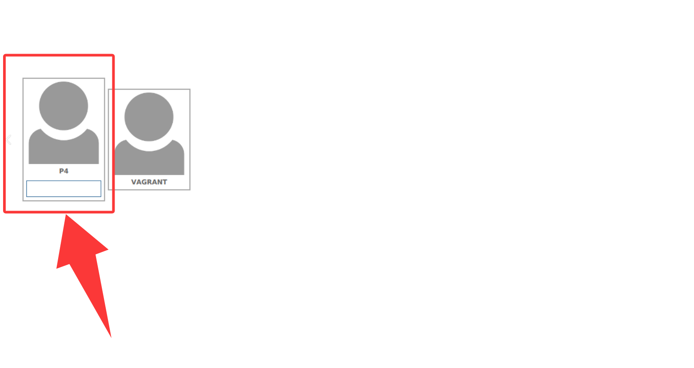

# LoopGen

Address learning is a fundamental SDN service that maintains a dynamic mapping from host addresses to switch ports, supporting many critical network applications. However, the address learning's core position makes it an attractive attack target. Meanwhile, unfortunately, it lacks security protection from a global view, resulting in the fact that individual, normal events can collectively cause damage. Based on it, this paper proposes LoopGen, a new attack targeting the address learning mechanism. LoopGen shows that adversaries who compromised hosts can induce the controller to create a data-plane forwarding loop by only sending crafted packets in a specific order. This loop makes LoopGen a cost-effective DoS amplifier that can be combined with different DoS attacks. We conduct extensive experiments, evaluating LoopGen using diverse real-world topologies, different open-source controllers, and heterogeneous switches. The results show that LoopGen has non-trivial feasibility, significant amplification effect, low attack cost, and high stealthiness under existing defenses. Finally, we propose two countermeasures to mitigate this attack.

# How to run

We provided a VM image to help quickly reproduce our experiments.

### 1. Please install [VirtualBox](https://www.virtualbox.org/) on your machine

### 2. Please import [our VM](https://drive.google.com/drive/folders/1DGbR66YWR8GL8689AoLM3l3vwYwraOwl?usp=sharing) using VirtualBox.

Login in via the `p4` username, the password is
```
p4
```



Then, for the experiment you want to try, please directly read the `readme.md` in the corresponding directory in `Experiment`.
